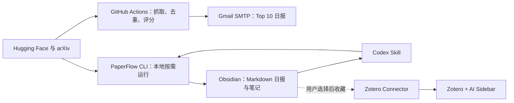

# PaperFlow 极简论文工作流设计

- 状态：已批准并完成用户书面复核，进入实施计划
- 日期：2026-08-20
- 首版平台：Windows 本地端；GitHub Actions 云端任务运行于托管 Linux Runner
- 项目许可：Apache-2.0

## 1. 目标

PaperFlow 是一个可放入 Git 仓库、可在其他 Windows 电脑重新安装的个人论文工作流。它每天从 Hugging Face Daily Papers、Hugging Face Trending Papers 和 arXiv 发现论文，通过 GitHub Actions 发送邮件；在本地由 Codex 调用命令行工具完成搜索、生成 Obsidian 日报和整理单篇论文。

长期资料只保存在现有工具中：

- Zotero 保存论文条目、PDF、批注和阅读状态。
- Obsidian 保存每日候选报告和最终知识笔记。
- PaperFlow 不再建立第三套数据库或长期论文库。

首版必须在不配置任何 AI API 的情况下完整运行。需要解释或深度阅读时，由用户当前使用的本地 Codex 会话按需处理。

## 2. 非目标

首版明确不建设：

- SQLite、PostgreSQL、Supabase 或其他数据库。
- 网站、登录系统、云端 API、远程 MCP、本地 MCP 或常驻服务。
- 桌面 GUI、浏览器管理后台或手机应用。
- 自动写入 Zotero、直接修改 `zotero.sqlite` 或修改 Zotero AI Sidebar 配置。
- 云端大模型总结、向量搜索、全文索引或批量深读。
- 云端 PDF、全文、图片、批注或 Obsidian Vault 存储。
- 微信、Telegram、飞书等多渠道推送。
- Linux/macOS 本地安装支持。

这些能力不能因为“将来可能需要”而进入首版。

## 3. 已考虑的架构

### 3.1 完全本地

Windows 任务计划程序运行抓取、写文件和邮件。它最简单，但电脑关机时无法按时汇报，因此不采用。

### 3.2 云数据库加本地客户端

GitHub Actions 写入云数据库，本地客户端同步状态。它能统一历史，但引入数据库、认证、同步协议、隐私和运维成本，因此不采用。

### 3.3 云端无状态日报加本地 Markdown

GitHub Actions 每天在内存中抓取、筛选、发信后退出；本地按需重新抓取并将报告写成 Markdown。邮件和本地报告不要求逐条一致。该方案满足电脑关机后仍能收到日报，同时没有云数据库和本地数据库，因此采用。

接受的取舍：云端没有跨日历史，更新过的论文可能再次出现在邮件中；云端和本地因运行时间不同也可能得到略有差异的结果。

## 4. 总体架构



系统只有一个可执行核心：Python 命令行包。GitHub Actions 和 Codex Skill 都调用它，不复制抓取、评分或报告逻辑。

## 5. 组件和源码边界

```text
paperflow/
├─ src/paperflow/
│  ├─ cli.py             # 参数解析、文本/JSON 输出、退出码
│  ├─ config.py          # TOML、本机环境变量、GitHub Secrets 映射
│  ├─ models.py          # Paper、SourceResult、DailyReport 数据结构
│  ├─ fetch.py           # Hugging Face 与 arXiv 客户端
│  ├─ normalize.py       # arXiv ID 规范化、单次运行去重
│  ├─ rank.py            # 关键词、类别、HF upvote 的确定性评分
│  ├─ report.py          # Markdown 与 HTML 邮件渲染
│  ├─ email.py           # Gmail SMTP 发送
│  ├─ obsidian.py        # 报告和单篇笔记的原子写入
│  └─ doctor.py          # 环境、配置、路径和外部应用检查
├─ codex/skills/paperflow/SKILL.md
├─ .github/workflows/daily.yml
├─ scripts/install-windows.ps1
├─ config.example.toml
├─ tests/
├─ LICENSE
├─ NOTICE
└─ README.md
```

不建立 repository、service、provider 等抽象层。每个模块直接服务一个首版需求；只有出现第二个真实实现时才提取接口。

## 6. 数据和文件

### 6.1 唯一论文标识

首版来源最终都指向 arXiv，因此唯一标识只使用去除版本后缀的 `arxiv_id`，例如将 `2608.12345v2` 规范化为 `2608.12345`。首版不设计 DOI 优先的通用 `paper_uid`。

### 6.2 本地配置

本地配置位于 `%APPDATA%\PaperFlow\config.toml`，不放进源码仓库。示例仓库只包含 `config.example.toml`。

配置包含：

- Obsidian Vault 绝对路径。
- 研究关键词及权重。
- arXiv 分类。
- 每日报告数量，默认 10。
- 本地历史去重窗口，默认扫描最近 30 份报告。
- 时区，默认 `Asia/Hong_Kong`。

本地配置不包含 Gmail 密码或 AI API Key。

### 6.3 Obsidian 输出

```text
<Vault>/PaperFlow/
├─ Reports/YYYY-MM-DD.md
└─ Papers/<arxiv_id>.md
```

日报的 YAML frontmatter 至少包含：

```yaml
date: 2026-08-20
generated_at: 2026-08-20T08:00:00+08:00
paperflow_version: 0.1.0
partial: false
sources:
  - hf-daily
  - hf-trending
  - arxiv
```

每篇候选使用稳定的 Markdown 字段：标题、`arxiv_id`、作者、来源、规则分数、匹配关键词、arXiv/PDF 链接和原始摘要截取。单篇正式笔记的 frontmatter 包含 `arxiv_id`、标题、作者、来源链接、创建日期和用户维护的阅读状态。

文件是唯一的本地持久化形式。搜索历史时直接扫描 Markdown；不维护旁路索引。

## 7. 命令行和 Codex 集成

首版公开四个命令：

```powershell
paperflow daily
paperflow search "关键词"
paperflow note <arxiv-id-or-url>
paperflow doctor
```

所有命令支持 `--json`，保证 Codex Skill 可读取稳定结构，而不是解析面向人的控制台文本。

- `daily`：抓取当天候选，本地扫描最近报告排除已出现的 arXiv ID，生成或原子替换当天 Markdown。
- `search`：按用户查询调用 arXiv/Hugging Face，并可同时返回本地 Markdown 中的历史命中；不保存在线搜索结果。
- `note`：从 arXiv ID 或 URL 获取元数据，生成单篇 Obsidian 模板。目标已存在时默认拒绝覆盖，只有明确传入 `--force` 才替换。
- `doctor`：只读检查 Python、配置、Vault、Codex Skill、Zotero、Obsidian 和 AI Sidebar，不修改外部应用。

Codex Skill 只描述意图到 CLI 命令的映射、JSON 结果解释和写文件前的确认规则。首版不启动 MCP Server。未来只有在 CLI 无法提供稳定的结构化调用或需要长生命周期交互时才重新评估 MCP。

## 8. 云端每日流程

GitHub Actions 默认每天香港时间 08:00 左右触发。定时任务可能因 GitHub 调度排队而延迟，系统不承诺精确到分钟。

流程为：

1. 检出公开源码。
2. 安装锁定版本的 Python 依赖。
3. 从 GitHub Secrets 读取私人配置。
4. 批量请求 Hugging Face Daily、Trending 和 arXiv。
5. 在内存中规范化 arXiv ID、单次运行去重、规则评分并选择 Top 10。
6. 渲染 HTML/纯文本邮件并通过 Gmail SMTP 发送。
7. 删除临时文件并结束 Runner。

云端不上传 Artifact，不提交日报，不保存搜索历史，也不下载 PDF 或论文图片。

需要的三个 GitHub Secrets：

- `PAPERFLOW_GMAIL_ADDRESS`
- `PAPERFLOW_GMAIL_APP_PASSWORD`
- `PAPERFLOW_PRIVATE_CONFIG_JSON`

第三个 Secret 包含收件地址、研究关键词、arXiv 分类、时区和 Top N。工作流不得打印 Secret 原文。默认不读取任何 OpenAI、Anthropic 或其他模型 API Key。

## 9. 排序与报告规则

排序必须可复现且不依赖模型：

- 标题关键词命中权重大于摘要命中。
- 用户为关键词配置整数权重。
- arXiv 分类命中提供固定加分。
- Hugging Face upvote 只提供有限加分，不能压过核心关键词。
- 同分时按发布日期、HF upvote、`arxiv_id` 做稳定排序。

邮件默认只含 10 篇，每篇提供标题、作者、来源、匹配原因、规则分数、链接和定长摘要截取。系统不得将摘要截取伪装成 AI 总结。

## 10. Zotero 与 AI Sidebar 边界

首版不自动创建 Zotero 条目。用户从邮件或 Obsidian 日报打开 arXiv 页面，再使用 Zotero Connector 收藏。收藏后，Zotero AI Sidebar 在 Zotero 内负责阅读和问答。

PaperFlow：

- 不直接读写 `zotero.sqlite`。
- 不读取或备份 Sidebar 的模型 API Key。
- 不启用 Sidebar 的 YOLO/无审批写入模式。
- 不自动开启 Sidebar WebDAV 配置同步。

安装程序只检查 Zotero 和 Sidebar 是否存在，并提供官方发行页安装指引。鉴于 Sidebar 当前备份/同步数据可能包含模型密钥，首版文档要求用户不要同步或公开其配置备份，直到上游明确完成密钥脱敏。

## 11. 安装、升级和卸载

另一台 Windows 电脑的标准流程：

```powershell
git clone <用户自己的 PaperFlow 仓库地址>
cd paperflow
powershell -ExecutionPolicy Bypass -File .\scripts\install-windows.ps1
```

安装脚本必须先展示检查结果和计划，再执行修改：

1. 检查 Git、Python、Codex、Zotero 和 Obsidian。
2. 对 Git、Python、Zotero 和 Obsidian，在存在可靠 `winget` 包时提供安装选项；未经确认不得安装。Codex 缺失时只显示随当前官方版本验证过的安装说明，不自动安装或登录。
3. 在仓库内创建 `.venv` 并安装锁定依赖。
4. 创建 `%LOCALAPPDATA%\PaperFlow\bin\paperflow.cmd`，并在用户同意后将该目录加入用户 PATH。
5. 将项目 Skill 安装到 `%CODEX_HOME%\skills\paperflow`；未设置 `CODEX_HOME` 时使用 `%USERPROFILE%\.codex\skills\paperflow`。
6. 交互式选择 Vault，写入 `%APPDATA%\PaperFlow\config.toml`。
7. 运行 `paperflow doctor` 并输出仍需人工处理的登录、XPI 确认和 GitHub Secrets。

安装脚本不收集 Gmail App Password，也不替用户登录 GitHub、Zotero、Obsidian 或 Codex。

云端邮件要求 Gmail 账户能够创建 App Password。若账户策略不允许 App Password，`doctor`/安装说明应明确报告该前置条件；首版不为此增加第二套邮件服务抽象。

升级通过 `git pull` 后重新运行安装脚本完成；脚本应保持幂等。卸载只删除 PaperFlow 自己创建的虚拟环境、命令包装器和 Skill，默认保留本地配置及 Obsidian 报告。删除保留数据必须使用单独的显式选项。

## 12. 失败处理和幂等性

- 每个网络请求有连接和总超时。
- 遇到网络错误、429 或可恢复的 5xx 时指数退避，最多重试三次。
- arXiv 使用低并发批量请求，避免原项目高并发富化导致限流。
- 一个来源失败时继续生成部分日报，并在邮件/Markdown 顶部列出失败来源。
- 所有来源失败时不写入或覆盖本地日报；云端任务失败，并在 SMTP 可用时发送简短错误邮件。
- SMTP 失败时工作流返回非零退出码，由 GitHub Actions 自身记录失败。
- 本地 Markdown 先写同目录临时文件，渲染和校验成功后再原子替换目标。
- 同一天重复执行 `daily` 只更新 `YYYY-MM-DD.md`，不会生成带序号副本。
- `note` 默认不覆盖已有笔记。
- 日志对邮箱、App Password 和私人配置做脱敏，不打印完整 Secrets。

## 13. 隐私、安全和成本

- 源码仓库可公开，但研究关键词、邮箱、报告、笔记、Zotero 数据和 Secrets 均不进入仓库。
- `.gitignore` 覆盖 `.venv`、临时文件、真实配置、日志和本地测试输出。
- GitHub Actions 使用最小默认权限，只需要读取仓库内容。
- 第三方依赖必须锁定版本；安装脚本不执行未经展示的远程脚本管道。
- 不上传 PDF、全文、批注、Vault 或 Zotero 数据。
- 不需要付费数据库、托管网站或模型 API。GitHub Actions、Gmail 和第三方服务的免费使用仍受各自账户配额和条款限制，因此不承诺“任何条件下绝对零费用”。

## 14. 上游代码与许可

- 可移植的抓取和评分代码来自 `huangkiki/dailypaper-skills` 时，保留 Apache-2.0 版权和 NOTICE 归属，并针对 Windows、限流和测试进行重写或适配。
- `huangkiki/zotero-ai-sidebar` 继续作为独立 AGPL-3.0-or-later 插件安装，不把其源码或 XPI 打包进 PaperFlow 发布物。
- 安装文档固定已验证的 Sidebar 版本，同时允许用户选择更新版本；PaperFlow 不承诺第三方插件未来版本兼容性。

## 15. 测试策略

### 15.1 单元测试

- Hugging Face JSON 与 arXiv Atom 固定样本解析。
- arXiv 版本号规范化和单次运行去重。
- 关键词权重、稳定排序和 Top N。
- Markdown/HTML 渲染与 HTML 转义。
- Secret 脱敏和配置校验。
- 同日原子替换、已有笔记拒绝覆盖。

### 15.2 集成测试

- 使用录制样本执行完整的抓取后处理，不依赖实时网络。
- 模拟单源失败、全部失败、429、SMTP 失败和无效 Vault。
- 在临时 Vault 中验证日报与单篇笔记路径及内容。
- 验证 CLI 的人类输出、JSON 输出和退出码一致。

### 15.3 平台测试

- `windows-latest` 验证本地安装脚本、CLI、路径和 UTF-8 中文输出。
- `ubuntu-latest` 验证 GitHub Actions 每日命令和邮件渲染。
- 实时 API 冒烟测试独立运行，失败不影响固定样本回归测试。

## 16. 七天试运行验收

首版只有同时满足以下条件才算完成：

1. 新 Windows 电脑 clone 后可通过一个脚本完成可自动化的安装步骤。
2. `paperflow doctor` 能准确指出缺失软件、配置、Vault、Codex Skill 和 Sidebar。
3. GitHub Actions 连续七天每天尝试发送一封 Top 10 邮件；上游无数据时允许发送空日报。
4. 本地 `daily` 生成结构正确的 Obsidian Markdown。
5. Codex 能通过 Skill 调用四个命令并解析 JSON。
6. 用户能从日报经 Zotero Connector 收藏，并在 AI Sidebar 中打开条目。
7. `note` 能创建单篇 Obsidian 笔记且不会静默覆盖已有内容。
8. 同一天重复运行不产生重复文件。
9. 不配置任何模型 API 时，除 AI Sidebar 自身能力外，PaperFlow 的每日发现、邮件、搜索和笔记模板流程均可运行。
10. 源码、Git 历史、Actions 日志和 Artifact 中没有个人数据或密钥。

## 17. 重新引入复杂度的触发条件

- 只有 Markdown 扫描被实际测量为影响日常使用时，才增加可删除、可重建的本地索引；首选生成式索引，不直接引入数据库。
- 只有 CLI JSON 无法支持真实 Codex 工作流时，才增加本地 STDIO MCP。
- 只有用户明确需要自动创建 Zotero 条目，且已确认官方安全写入接口时，才增加 Zotero 写入。
- 只有需要多用户协作、跨设备共享阅读状态时，才重新评估云数据库和认证。
- 只有用户接受明确的 API 预算时，才允许云端模型总结。
- 只有邮件连续不能满足需求时，才评估第二种推送渠道。

任何扩展都应以七天试运行中的真实痛点为证据，并单独设计、测试和批准。
